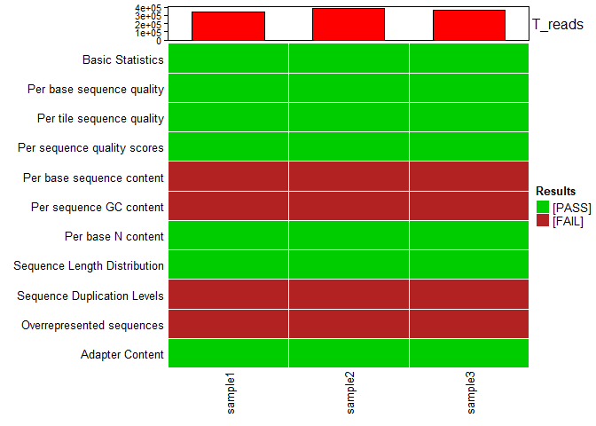
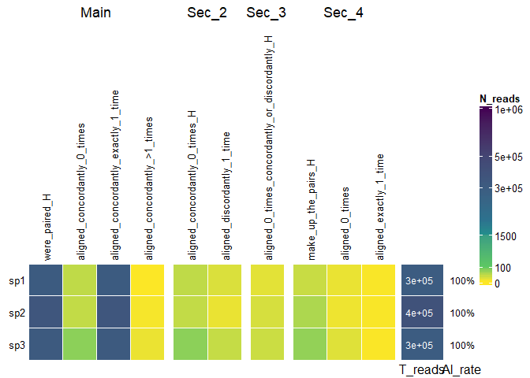
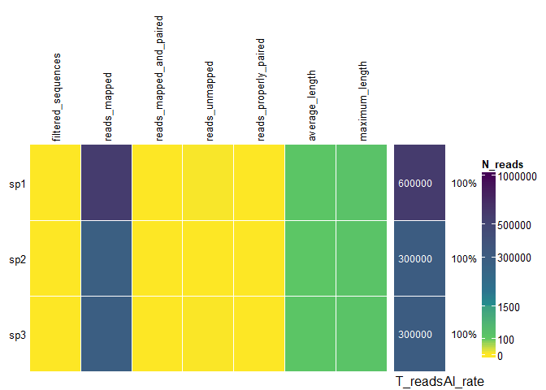

<!-- README.md is generated from README.Rmd. Please edit that file -->

# SeqReport

<!-- badges: start -->
<!-- badges: end -->

The goal of SeqReport is to combine the reports from software used in
DNA/RNA sequences quality control and alignment from multiple samples
into one summarized table or plot. The idea is make it easier to compare
samples before and after processing steps (e.g. trimming) and compare
between different alignment parameter or software. Currently, combine
the reports from
[FastQC](https://www.bioinformatics.babraham.ac.uk/projects/fastqc/),
[Bowtie 2](http://bowtie-bio.sourceforge.net/bowtie2/index.shtml) and
[BWA](http://bio-bwa.sourceforge.net/bwa.shtml).

## Installation

You can install the development version of SeqReport from
[GitHub](https://github.com/) with:

``` r
# install.packages("devtools")
devtools::install_github("RaquelPinho/SeqReport")
```

## Example

In this first example, I am showing how the FastQC report from multiple
samples can be visualized in one plot:

``` r
library(SeqReport)
parent_dir <- file.path(system.file(paste0("extdata/testdata/"), package = "SeqReport"))
fastqc_table <- readRDS(file.path(parent_dir, "test_fqc_table_samples.RDS"))
fastqc_heatmap_stats(fastqc_table)
```

 And
summarized:

``` r
fastqc_report_summary(fastqc_table = fastqc_table,
                      path = NULL,
                      exclude = NULL)
#> Summary of the FASTQC files.
#> There were 3 files analyzed.
#> 
#> In those, the average number of reads was 366968.3.
#> 
#> The minimun number of reads was 345921 from samples: sample1
#> 
#> The maximun number of reads was 390951 from samples: 
#> sample2
#> The average, minimun and maximun read lengths were 
#> 150, 150, 150 respectively.
#> 
#> Samples with the minimum average read length were: all
#> 
#> Samples with overrepresented adapter sequences: 
#> sample1
#> sample2
#> sample3
#> 
#> FASTQC flags that fail in more than 50% of the samples: 
#> Per base sequence content
#> Per sequence GC content
#> Sequence Duplication Levels
#> Overrepresented sequences
```

The visualization of Bowtie2 and BWA alignment reports can also be done:

### Bowtie

``` r
dir <- file.path(system.file(paste0("extdata/testdata/Bowtie/"), package = "SeqReport"))
dt_bowtie <- bowtie_group_report(path = dir, samples = c("sp1", "sp2", "sp3"))
bowtie_plot <- bowtie_heatmap(dt_bowtie)
```

``` r
bowtie_plot
```



``` r
bowtie_report_summary(dt_bowtie = dt_bowtie,
                          path = NULL,
                          exclude = NULL)
#> Summary of the bowtie log files.
#> There were 3
#> samples analyzed.
#> In those, the average number of reads was 
#> 330574 and the median 325006.
#> 
#> The minimun number of reads was 310059 from samples: sp1
#> 
#> The maximun number of reads was 356657 from samples: sp2
#> 
#> The average, median, minimun and maximun rate of paired reads were 
#> 100%, 100%, 100% and 100% respectively.
#> 
#> Samples with the minimum rate of paired reads were: all
#> 
#> The average, median, minimum and maximun alignement rate were 
#> 100%, 100%, 100% and 100% respectively.
#> 
#> Samples with the minimum alignment rate were: all
#> 
#> The concordant alignment rate for the paired reads were in average  
#> 99.98333% with a median, minimum and maximun of 99.99%, 
#> 99.97%, 99.99% respectively.
#> 
#> Samples with the minimun concordant alignment rate were:sp3
#> .
```

### BWA

``` r
dir <- file.path(system.file(paste0("extdata/testdata/BWA/"), package = "SeqReport"))
dt_bwa <- bwa_report_group(path = dir, samples = c("sp1", "sp2", "sp3"))
bwa_plot <- bwa_heatmap(dt_bwa)
```

``` r
bwa_plot
```



``` r
bwa_report_summary(dt_bwa = dt_bwa,
                          path = NULL,
                          exclude = NULL)
#> Summary of the bwa report files.
#> There were 3
#> samples analyzed.
#> In those, the average number of reads was 
#> 386054 and the median 282453.
#> 
#> The minimun number of reads was 278769 from samples: sp2
#> 
#> The maximun number of reads was 596940 from samples: sp1
#> 
#> The average, median, minimun and maximun rate of paired reads were 
#> 0%, 0%, 0% and 0% respectively.
#> 
#> Samples with the minimum rate of paired reads were: all
#> 
#> The mean, minimum and maximum average fragment size were 176
#> , 160 and 186, respectivbely.
#> 
#> The average, median, minimum and maximun alignement rate were 
#> 100%, 100%, 100% and 100% respectively.
#> 
#> Samples with the minimum alignment rate were: sp3
#> 
#> The inward, concordant alignment rate for the paired reads were in average  
#> NaN% with a median, minimum and maximun of NA%, NaN%, NaN
#> % respectively.
#> 
#> Samples with the minimun concordant alignment rate were:.
```
